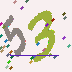
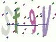
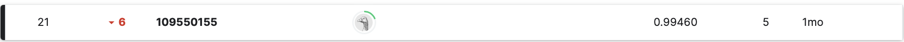

# ML_CAPTCHA_SOLVER
這是一個關於[kaggle競賽](https://www.kaggle.com/competitions/captcha-hacker/overview)的作品呈現，透過以下流程能成功復現，程式碼解釋以及相關實驗可以詳見`109550155_HW5.pdf`。

## task description
使模型能夠正確分辨以下三種任務：
1.只有一個數字：  
  
2.有兩個符號：  
  
3.有四個符號：  
  

## installation
我採用的python version為`3.9.7`。
首先下載`109550155_Final_train.py`、`109550155_Final_test.py`、`requirements.txt`，接著用以下指令以符合執行環境。
```bash
pip install -r requirements.txt
```
接著到該kaggle競賽去下載dataset以及`sample_submission.csv`
## training
對於不同任務需訓練不同的模型，`109550155_HW5_train_task{1,2,3}.py`  
進入`109550155_HW5_train_task{1,2,3}.py`修改路徑至指定位置並執行
```bash
python 109550155_HW5_train_task{1,2,3}.py
```
可以得到`save_swin{1,2,3}.pth`

## inference
進入`109550155_HW5_inference.py`修改以下路徑至指定位置並執行
```bash
python 109550155_HW5_inference.py 
```
可以得到`109550155.csv`。
## result
我在validation set上測試時，task1可到100%，task2約為99.7%，而task3落在99%
public scoreboard上是15/108  
而在private scoreboard上的成績為21/108：


